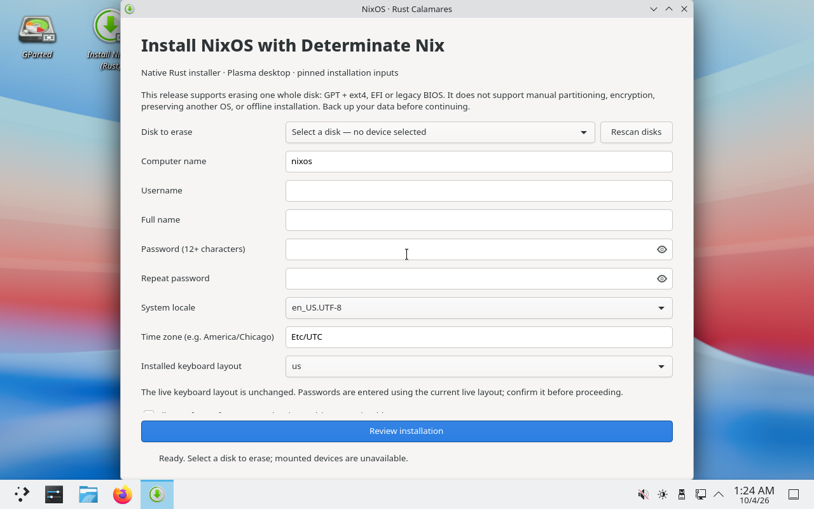

# NixOS graphical installer with Determinate Nix

An unofficial, x86_64 NixOS live ISO with KDE Plasma, Determinate Nix and a
[NixOS-focused Rust/GTK4 Calamares fork](https://github.com/bitemyapp/calamares/tree/codex/nixos-rust).
It uses the official NixOS graphical base, but **not** the upstream C++/Python
Calamares engine. It is not endorsed by NixOS, Calamares or Determinate Systems.



## Supported workflow

The native installer supports guided **whole-disk erase**, GPT/ext4, UEFI with
systemd-boot or legacy BIOS with GRUB, and an installed Plasma desktop.
You choose the hostname, normal user, password, full name, timezone, one of
eight locales/keyboards, and whether to allow unfree packages.

This experimental first release does **not** support manual partitioning,
preserving another OS, encryption, RAID/LVM, Btrfs, offline installation,
other desktop choices, translated UI or upstream Calamares plugins.
Network access is required. Back up data before using it on a real disk.
See [TESTING.md](TESTING.md) for the tested scenarios and their limits.

Both the live and installed systems use Determinate Nix, Determinate Nixd and
`fh`. The boot menu offers an LTS kernel and a latest-kernel specialisation;
the native installer carries that choice into its target configuration.

## Locked sources and clean integration

The three-input system lock comes unchanged from DeterminateSystems/nixos-iso
revision `72a5c3aaddbd58b339a76bc4e98945d9ff981b1e`:

| Component | Revision/version |
| --- | --- |
| Nixpkgs | `c59305bab2065cfecc4944690d9eedbb56f3a9fa` (26.11 rolling) |
| Determinate | 3.23.0, `68e51a34285ceb664e74d078bcd46a15f984dfe4` |
| FlakeHub CLI | 0.1.27, `4f001f2e1de4776f01cf22d1de815f1016a4c4c9` |
| Rust installer | Exact Git revision and content hash in [nix/calamares-source.json](nix/calamares-source.json) |

The installer is fetched separately so it does not add a fourth input to the
installed machine's lock. It writes the hostname-keyed flake, copies the lock
verbatim, generates hardware configuration with the normal NixOS tool, and calls
`nixos-install --flake` explicitly. There is no Python patch, PyO3 bridge,
Calamares global-storage hook, Perl flake override or duplicate INI defaults.

One root-owned JSON file configures the live installer. The GUI is unprivileged;
all expensive work runs on workers or in its Rust helper. Authorization uses
NixOS's Polkit wrapper and an exact-helper policy. The live session grants only
that installer action to the active local `nixos` user, not blanket Polkit access.
No installer configuration, live user, autologin or live permission rules are
imported into the installed system. Password hashes stay in a root-only runtime
file outside the flake source, never in the Nix store.

## Build

With Nix on an x86_64 Linux host:

```sh
nix flake check --no-update-lock-file -L
nix build .#iso --no-update-lock-file -L
sha256sum result/iso/*.iso
```

Without installing Nix on the host, use the rootless QEMU builder:

```sh
cargo install rust-script --version 0.36.0 --locked
rustup target add x86_64-unknown-linux-musl
rust-script --force scripts/build_rootless.rs /path/to/nixos-with-determinate.iso
```

Requirements: Linux x86_64, QEMU/KVM access, `bsdtar`, OpenSSH, Rust/Cargo,
rust-script, about 16 GiB available RAM and at least 40 GiB free disk space.
The reusable sparse builder disk has a maximum size of 100 GiB. Builds download
several GiB. Normal package signature/hash checking remains enabled.

The builder checks the bootstrap ISO's SHA-256, builds in the VM and atomically
exports the ISO and checksum into `artifacts/native-rust/`. Its Nix store is in
`.work/rootless/builder.raw`; it never attaches a host block device or needs
host sudo. Logs are in `artifacts/native-rust/build.log`. Earlier ISO artifacts
and the completed `codex/rustscript-scripts` branch are preserved.

The default bootstrap hash is
`80588c226d84e16fe11b2e4afa9fc4add02902e7041dcb220960df5a6cde5fb5`.
For a different bootstrap image, pass `--sha256` with a separately verified
hash; that changes the build environment, not the pinned output inputs.

## QEMU verification

```sh
rust-script --force scripts/qemu_test.rs artifacts/native-rust/NAME.iso --firmware uefi --install
rust-script --force scripts/qemu_test.rs artifacts/native-rust/NAME.iso --firmware bios --install
```

Tests boot the complete ISO as read-only **USB mass storage**, through real
firmware, not direct kernel boot. UEFI needs OVMF; set `OVMF_CODE` and
`OVMF_VARS` if your matching firmware files differ from the Arch/CachyOS defaults.
Secure Boot is not enabled.

Installation tests create a fresh 40 GiB regular-file virtual disk, invoke the
real packaged helper and boot the installed disk without the ISO. The fixed
public test credentials are only used in the disposable VM. A statically linked
fixture is built from the **same pinned fork revision** and shared into the VM;
neither this fixture nor the orchestration tools are shipped on the normal ISO.

The fixture first checks the real media configuration with diagnostics disabled.
It enables a guest agent and serial console only inside the guarded test VM,
never by editing store contents. Installed-system checks include unchanged
lock, Determinate services, protected password hash, real PAM rejection and
acceptance, locked root, and absence of live-only settings. Screenshots and JSON
results are under `artifacts/`. Backend tests do not by themselves verify every
interactive GUI control; recorded GUI checks are identified in TESTING.md.

For a supervised GUI-to-helper test, add `--gui` (it implies `--install`).
The test waits up to ten minutes for an operator to fill the actual GUI, then
checks the installed disk and signs into Plasma with the public test password.
Use `tests/qmp_input.rs RUN-NAME screenshot|click|key|type` to inspect and drive
the fixed 1280×800 virtual display; it only accepts this repository's disposable
40 GiB test-image runs. No fixture installation request is submitted in GUI mode.
Use these exact test values: `/dev/vda`, hostname `rust-test`, username `rusttest`,
full name `Rust ${literal} Test`, password `Qemu-Only-Test-123!`, timezone
`America/Chicago`, locale `en_US.UTF-8`, keyboard `us`, and unfree disabled.
Review the disk and type `ERASE /dev/vda` only inside that disposable VM.

A completed backend install can be boot-tested again with
`rust-script --force scripts/boot_installed.rs RUN-NAME`. This reuses only its
known regular-file test disk and firmware variables, with no ISO attached.

## Development and installed-system maintenance

All first-party executable scripts are ordinary executable Rust scripts.
They share the locked native implementation in `rust/`; no Python dependency
or embedded Python fixture remains. The installer implementation lives in the
separate GPL-3.0-or-later fork. Declarative Nix build commands, Polkit rules and
small fixed guest/SSH command strings still use their native interfaces.

```sh
cargo test --manifest-path rust/Cargo.toml --locked
cargo clippy --manifest-path rust/Cargo.toml --all-targets --locked -- -D warnings
cargo fmt --manifest-path rust/Cargo.toml --check
rust-script --force tests/process_cleanup.rs
```

Use script shebangs or `rust-script --force` to detect changes in the shared
local crate. Cargo still reuses unchanged dependencies.

The installed configuration is in `/etc/nixos/`. Rebuild with
`sudo nixos-rebuild switch --flake /etc/nixos#YOUR-HOSTNAME`.
A hostname change does not automatically rename the flake output.
Update inputs deliberately with `sudo nix flake update` from `/etc/nixos`;
do not change `system.stateVersion` merely to upgrade packages.

The password hash is in `/etc/nixos-secrets/user-password.hash` (root-only),
referenced by `hashedPasswordFile`. Update/remove that declarative setting
appropriately if you want later password changes to persist across activation.

ISOs, logs, private builder keys and virtual disks remain ignored under
`artifacts/` and `.work/`. Publish source normally and large ISO/checksum files
as separate release assets if desired. Integration code is Apache-2.0; upstream
components retain their licenses. See [NOTICE](NOTICE).
