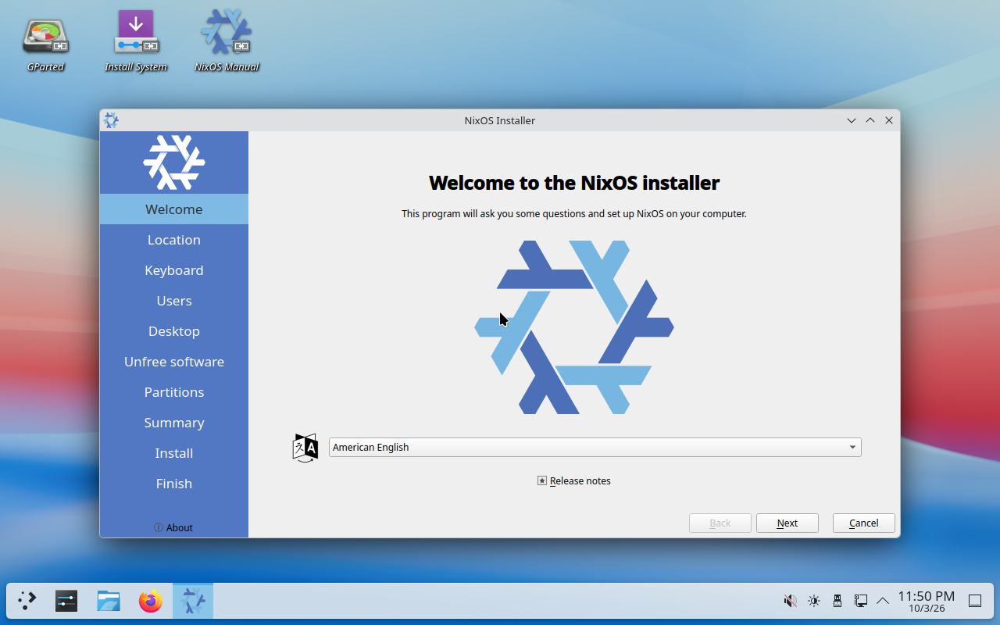

# NixOS graphical installer with Determinate Nix

An **unofficial** respin of [Determinate Systems' NixOS ISO](https://github.com/DeterminateSystems/nixos-iso), using the [official NixOS Plasma/Calamares installer](https://github.com/NixOS/nixpkgs/blob/c59305bab2065cfecc4944690d9eedbb56f3a9fa/nixos/modules/installer/cd-dvd/installation-cd-graphical-calamares-plasma6.nix).

The live system boots into KDE Plasma and starts Calamares. Its normal desktop,
partitioning, locale, user and bootloader choices remain available. Both the live
system and the installed system use Determinate Nix, Determinate Nixd and `fh`.
Flakes are enabled by Determinate's NixOS module.



The boot menu provides Plasma with either the LTS kernel or the newer kernel,
as in Determinate's minimal combined ISO. Calamares retains that kernel choice
in the installed configuration.

This is a community project, not an official release or endorsement from NixOS
or Determinate Systems. This first version supports **x86_64 Linux** and retains
the rolling NixOS revision used by the source Determinate ISO, rather than
silently switching it to another NixOS release.

## Pinned inputs

The input lock is copied from DeterminateSystems/nixos-iso revision
`72a5c3aaddbd58b339a76bc4e98945d9ff981b1e`.

| Component | Pinned version |
| --- | --- |
| NixOS/nixpkgs | `c59305bab2065cfecc4944690d9eedbb56f3a9fa` (26.11 rolling, 2026-10-01) |
| Determinate | 3.23.0 (`68e51a34285ceb664e74d078bcd46a15f984dfe4`) |
| FlakeHub CLI | 0.1.27 (`4f001f2e1de4776f01cf22d1de815f1016a4c4c9`) |
| Calamares / NixOS extensions | 3.4.2 / 0.3.23, from the pinned nixpkgs |

## Why a Calamares patch is needed

Determinate's minimal ISO customizes `nixos-generate-config` to generate a flake
that imports its NixOS module. At the pinned revision, Calamares then calls
`nixos-install` without `--flake`. NixOS explicitly avoids automatically selecting
a flake because it does not know which configuration name to use. Merely adding
the graphical ISO module would therefore leave Determinate out of the installed
system.

Our small patch keeps Calamares's generated `configuration.nix` and hardware
configuration, writes a target `flake.nix` keyed by the GUI-selected hostname,
copies the ISO's `flake.lock`, and explicitly selects that configuration for
`nixos-install`. The target imports Determinate and includes `fh`. Live media
settings (installer packages, the `nixos` user, live autologin and permissive live
Polkit rules) are not imported into the target.

The desktop choices are the official Calamares choices; Plasma is the live
desktop, not a restriction on the desktop you install. Installation requires an
Internet connection to retrieve pinned inputs and any packages absent from the
live store. Encrypted installs and alternative desktop choices are inherited
from upstream; see `TESTING.md` for the exact scenarios verified here.

## Build with Nix

On an x86_64 Linux machine with flakes enabled:

```sh
nix flake check --no-update-lock-file -L
nix build .#iso --no-update-lock-file -L
sha256sum result/iso/*.iso
```

The ISO is in `result/iso/`. This is a declarative rebuild from locked sources,
not a modification of a downloaded ISO's filesystem. Ordinary package
substitutions retain Nix's signature/hash checking. There is no requirement to
log into FlakeHub to build the public configuration.

## Build without installing Nix on the host

Requirements: Linux x86_64, QEMU with KVM, `bsdtar`, OpenSSH, Rust/Cargo,
[`rust-script`](https://rust-script.org/), access
to `/dev/kvm`, about 16 GiB available RAM and 40 GiB free disk space. The sparse
builder disk has a maximum size of 100 GiB. Builds can download several GiB.

```sh
cargo install rust-script --version 0.36.0 --locked
rustup target add x86_64-unknown-linux-musl
rust-script --force scripts/build_rootless.rs /path/to/nixos-with-determinate.iso
```

The script checks the SHA-256 of the original Determinate ISO used for this
respin, starts a disposable builder VM, builds with its existing Determinate Nix,
and copies the output ISO into `artifacts/rust-script/`. It needs **no host sudo**. Its reusable
Nix store is in `.work/rootless/builder.raw`; it never attaches a host block
device. Detailed output is saved in `artifacts/rust-script/build.log`. The Rust
builder exports the ISO atomically and writes its SHA-256 sidecar; it does not
overwrite the original pre-migration ISO in `artifacts/`.

The guest bootstrap is a statically linked Rust executable, built on the host
from the same sources. No Rust compiler or Cargo registry access is needed in
the bootstrap VM or live installer. The downloaded bootstrap ISO and all flake
inputs remain unchanged.

For another bootstrap ISO, supply `--sha256` with a separately verified hash.
That changes only the build environment; the repository's lock still determines
the built image. The bootstrap hash used here is
`80588c226d84e16fe11b2e4afa9fc4add02902e7041dcb220960df5a6cde5fb5`.

## Test in QEMU

These tests boot the complete ISO as a **USB mass-storage device**, through real
firmware. They do not use direct kernel boot or present the ISO as a CD to claim
USB bootability.

```sh
rust-script --force scripts/qemu_test.rs artifacts/rust-script/NAME.iso --firmware bios
rust-script --force scripts/qemu_test.rs artifacts/rust-script/NAME.iso --firmware uefi
rust-script --force scripts/qemu_test.rs artifacts/rust-script/NAME.iso --firmware uefi --install
```

UEFI tests require OVMF. The defaults match Arch/CachyOS's `edk2-ovmf` paths;
override `OVMF_CODE` and `OVMF_VARS` with matching firmware files on other hosts.
Secure Boot is not enabled for these tests.

Tests save screenshots, serial logs and a JSON result under `artifacts/`. The
optional installation test supplies fixed form values to the real packaged
Calamares Python job, installs Plasma to a fresh 40 GiB virtual disk, and boots
that disk with the ISO removed. It adds a guest agent and serial console to the
test target for diagnostics; normal GUI installations do not get these test
settings. This is a backend integration test, not an automated click-through of
every Calamares page. The actual live GUI is checked separately.

If a test was interrupted **after** its log recorded `CALAMARES_INSTALL_PASS`,
the installed disk can be verified without reinstalling:

```sh
rust-script --force scripts/boot_installed.rs RUN-NAME
```

This accepts only a completed installation run from `artifacts/` and `.work/`,
uses its original virtual disk and firmware variables, and attaches no ISO.

## RustScript implementation and development

All first-party executable scripts are `.rs` files with a `rust-script` shebang
and embedded Cargo manifest. They share the implementation in `rust/`; they do
not launch the old Python or shell scripts. `rust/Cargo.lock` pins the production
tool's dependencies, and the Nix build compiles with that lock without network
access in its build sandbox. `rust-script` maintains its own Cargo cache for the
developer entry points; use the locked Cargo/Nix build for release validation.
Use `--force` when invoking `rust-script` explicitly: its script cache does not
notice changes to this shared local dependency on its own. All entry-point
shebangs include `--force`, so direct execution (for example,
`./scripts/qemu_test.rs ...`) automatically asks Cargo to check for changes.
Cargo still reuses unchanged compiled dependencies.

The ISO includes the precompiled Rust installer helper and test driver. The
upstream Calamares job remains Python: the small upstream patch invokes the
Rust helper, and the integration test supplies Rust callbacks through PyO3 to
the real Calamares module. No Python test fixture is embedded or generated.
Nix derivation commands and short SSH/serial/guest-agent command strings still
use the shell where those interfaces require it.

```sh
cargo test --manifest-path rust/Cargo.toml --locked
cargo test --manifest-path rust/Cargo.toml --locked --features calamares
cargo clippy --manifest-path rust/Cargo.toml --all-targets --features calamares -- -D warnings
cargo fmt --manifest-path rust/Cargo.toml --check
rust-script --force tests/process_cleanup.rs
```

The `calamares` feature requires CPython development libraries on the developer
machine. They are provided by Nix for the packaged tools; host-side rootless
building and VM orchestration do not require host Python. RustScript entry
points also support `--help`; guest-only commands retain disk-serial, size,
filesystem and privilege checks before any partitioning or formatting.

## After installation

The installed configuration is `/etc/nixos/{flake.nix,flake.lock,configuration.nix,hardware-configuration.nix}`.
Use the hostname chosen in Calamares as the flake output name:

```sh
sudo nixos-rebuild switch --flake /etc/nixos#YOUR-HOSTNAME
```

To update packages and Determinate deliberately:

```sh
cd /etc/nixos
sudo nix flake update
sudo nixos-rebuild switch --flake /etc/nixos#YOUR-HOSTNAME
```

Changing `networking.hostName` later does not rename the flake output. Rename the
output yourself or keep using its original name. `system.stateVersion` is the
compatibility setting generated by Calamares; do not change it just to upgrade.

## Repository layout and publication

- `flake.nix`, `flake.lock`: image definition and exact upstream revisions.
- `modules/installer.nix`: live installer integration.
- `templates/flake.nix.in`: installed system's flake template.
- `calamares/prepare_target.rs`, `patches/`: the installation handoff.
- `tests/`, `scripts/`: executable RustScript entry points.
- `rust/`: shared Rust implementation, unit tests and locked dependencies.
- `nix/tools.nix`: the offline-built native installer helper and test driver.
- `TESTING.md`: recorded results and verification limits.

`.work/`, `artifacts/`, virtual disks, generated SSH keys, logs and ISOs are
ignored by Git. Publish the source repository normally; publish the large ISO
and its SHA-256 separately as release assets if desired. No GitHub repository or
remote is created by the local build.

The repository's integration code uses Apache-2.0; see `LICENSE` and `NOTICE`.
Bundled components retain their upstream licenses.
