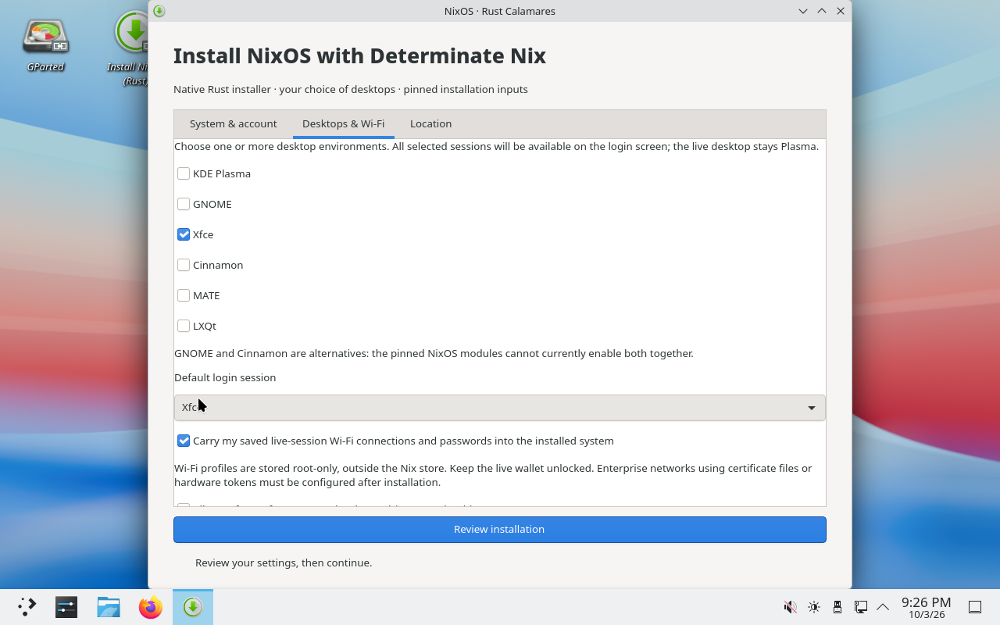

# NixOS graphical installer with Determinate Nix

An unofficial, x86_64 NixOS live ISO with KDE Plasma, Determinate Nix and a
[NixOS-focused Rust/GTK4 Calamares fork](https://github.com/bitemyapp/calamares/tree/codex/nixos-rust).
It uses the official NixOS graphical base, but **not** the upstream C++/Python
Calamares engine. It is not endorsed by NixOS, Calamares or Determinate Systems.



## Supported workflow

The native installer supports guided **whole-disk erase**, GPT with ext4
(default), Btrfs or XFS, UEFI with systemd-boot or legacy BIOS with GRUB. The default live desktop is Plasma, while the
installer lets you select **one or more** of Plasma, GNOME, Xfce, Cinnamon,
MATE and LXQt and choose the default login session. Plasma is preselected.
GNOME and Cinnamon cannot be combined in this pinned NixOS version because
their modules conflict on GSettings; the UI explains and validates this limit.
You choose the hostname, normal user, password, full name, timezone, one of
eight locales/keyboards, and whether to allow unfree packages (enabled by default).

Both the live image and installed system include redistributable device firmware,
which can be proprietary. The live image also enables both Intel and AMD CPU
microcode bundles; installed CPU settings come from upstream hardware detection.
The installed system permits additional unfree packages
by default, with an explicit GUI opt-out. Opting out does not remove redistributable
firmware or make the system strictly free-software-only. Package permission is
not automatic driver selection: NVIDIA/hybrid graphics and unusual out-of-tree
drivers still need hardware-specific configuration. The installer preserves
upstream hardware detection and does not force unrelated vendor drivers on all PCs.

This experimental first release does **not** support manual partitioning,
preserving another OS, encryption, RAID/LVM, offline installation,
translated UI or upstream Calamares plugins.
Btrfs uses compression on one root volume; automatic snapshots are not configured.
The EFI boot partition always uses FAT32.
Network access is required. Back up data before using it on a real disk.
See [TESTING.md](TESTING.md) for the tested scenarios and their limits.

Saved live-session **Wi-Fi** profiles and passwords transfer by default, with an
opt-out and a count on the review screen. They are obtained through the live
user's NetworkManager/Secret Agent and written as root-only keyfiles outside
the Nix store and flake. Live-user restrictions are remapped to the installed
user. No Ethernet/VPN profiles are copied. Keep the live wallet unlocked;
missing credentials stop review. Enterprise networks using external certificate
files or hardware tokens need manual configuration after installation.

**Time-zone detection** first preserves a regional zone configured in the live
session. If the live zone is unset/UTC, a bounded HTTPS request to ipapi.co
suggests a zone from your public IP (the provider receives that IP). The UI
explains the approximation, offers an internet opt-out and manual override,
and requires confirmation. VPN/mobile routing can mislead IP geolocation.
Failures do not default to US Eastern, and late responses cannot overwrite
manual edits. US Central uses `America/Chicago`, including daylight saving.

Both the live and installed systems use Determinate Nix, Determinate Nixd and
`fh`. The boot menu puts the kernel and session first so they remain visible on
narrow displays:

- `7.2.8 Plasma (default)`: the latest kernel in the existing pinned Nixpkgs.
- `7.2.8 Xfce/X11 (software)`: a recovery live desktop with software rendering
  and no Xfce compositor; avoids the Plasma/KWin Wayland session.
- `6.18.54 Plasma (LTS)`: the older-kernel fallback.

The native installer carries the selected **kernel** into the target configuration.
The recovery live desktop does **not** restrict the desktop choices in the installer
or force software rendering on the installed OS. The user confirmed the latest
Plasma entry resolved the reported ThinkPad display/input symptoms; the subsequent
Wi-Fi backend fix still needs a physical radio retest.

Boot progress is visible rather than hidden by a splash screen. If the GUI fails
but `Ctrl+Alt+F3` works, run this in the live console:

```sh
sudo installer-live-diagnostics > /tmp/installer-hardware-report.txt
```

Save the report before rebooting; `/tmp` is volatile. It includes hardware
identifiers and kernel/display-manager logs, so review before sharing. It neither
uploads anything nor reads saved Wi-Fi profiles or raw keyboard events.

## Locked sources and clean integration

The original three system inputs retain their pins from DeterminateSystems/nixos-iso
revision `72a5c3aaddbd58b339a76bc4e98945d9ff981b1e`. Three additional inputs
provide the optional application catalog:

| Component | Revision/version |
| --- | --- |
| Nixpkgs | `c59305bab2065cfecc4944690d9eedbb56f3a9fa` (26.11 rolling) |
| Determinate | 3.23.0, `68e51a34285ceb664e74d078bcd46a15f984dfe4` |
| FlakeHub CLI | 0.1.27, `4f001f2e1de4776f01cf22d1de815f1016a4c4c9` |
| Application Nixpkgs | `a7868a727837f3c09cee2ce0ca671c76b1589fed` (nixos-unstable) |
| AI applications | Numtide llm-agents.nix, `372f0337e8170e55ff0c017cd43ab73b02a062ad` |
| oh-my-pi | Upstream release v18.6.1, `2a2c6dcbbb558c0f8145f67f28b3370984f2bf60` |
| Rust installer | Exact Git revision and content hash in [nix/calamares-source.json](nix/calamares-source.json) |

The installer is fetched separately from the installed system's six inputs.
It writes the hostname-keyed flake, copies the lock
verbatim, generates hardware configuration with the normal NixOS tool, and calls
`nixos-install --flake` explicitly. There is no Python patch, PyO3 bridge,
Calamares global-storage hook, Perl flake override or duplicate INI defaults.

One root-owned JSON file configures the live installer. The GUI is unprivileged;
all expensive work runs on workers or in its Rust helper. Authorization uses
NixOS's Polkit wrapper and an exact-helper policy. The live session grants only
that installer action and NetworkManager actions to the active local `nixos`
user, not blanket Polkit access. NetworkManager's normal live-user access is
explicitly retained when replacing the graphical base's broad wheel rule.
No installer configuration, live user, autologin or live permission rules are
imported into the installed system. Password hashes stay in a root-only runtime
file outside the flake source, never in the Nix store.

The installer parses raw form/JSON input into an immutable reviewed plan. Only
an explicitly confirmed plan can reach the executor; the privileged helper
parses again at the IPC boundary. Desktop/default-session rules and normalized
Wi-Fi profiles stay in the parsed values. Disk and mount state are still
checked at the point of use. See the fork's
[architecture notes](https://github.com/bitemyapp/calamares/blob/codex/nixos-rust/RUST-INSTALLER.md#parse-once-per-process-boundary).

## Build

The Applications tab offers 31 optional applications and tool bundles with
search, categories and brief descriptions. Firefox is selected by default.
Rustup also selects the C/C++ build tools. Docker Engine + Compose uses a
rootless user service. Proprietary choices follow the unfree-software setting.
See [application sources and checks](docs/applications.md).

The ISO caches the optional application packages without activating them in the
live desktop. This increases image size, but avoids downloading large selections
into the live session's temporary storage. Before erasing a disk, the helper
resolves the selected package closure and checks its disk-space requirement.
Network access is still required for the complete NixOS installation.

With Nix on an x86_64 Linux host:

```sh
nix flake check --no-update-lock-file -L
nix build .#iso --no-update-lock-file -L
sha256sum result/iso/*.iso
```

Without installing Nix on the host, use the rootless QEMU builder:

```sh
cargo install rust-script --version 0.36.0 --locked
rustup target add x86_64-unknown-linux-musl
rust-script --force scripts/build_rootless.rs /path/to/nixos-with-determinate.iso
```

Add `--rebuild-iso` to force Nix to rebuild and compare the ISO output instead
of only reusing an existing image. Dependencies can still use the verified
cache. A successful comparison checks byte-for-byte reproducibility.
The preceding [physical USB verification](docs/usb-verification.md) records a
forced rebuild, full media read-back and direct read-only UEFI/BIOS boots.
The replacement [hardware-reliability candidate](docs/hardware-reliability.md)
documents the later physical failure, short menu labels and recovery profile,
plus its verified Samsung write/read-back and direct UEFI/BIOS USB boots.
The current [Wi-Fi and hardware-defaults report](docs/wifi-hardware-defaults.md)
records the user's successful display/input retest, the missing supplicant fix,
firmware/unfree policy and final-image radio regression tests.

Requirements: Linux x86_64, QEMU/KVM access, `bsdtar`, OpenSSH, Rust/Cargo,
rust-script, about 32 GiB available RAM and at least 100 GiB free disk space
for the builder store and exported image with the optional application cache.
The builder VM uses 24 GiB of RAM and limits source compilation to one package
at a time with four build cores. The reusable sparse builder disk has a maximum
size of 100 GiB. Builds download
several GiB. Normal package signature/hash checking remains enabled.

The builder checks the bootstrap ISO's SHA-256, builds in the VM and atomically
exports the ISO and checksum into `artifacts/native-rust/`. It also evaluates
the Rust backend's actual generated configurations for all 47 supported desktop
combinations and 34 application cases against the pinned NixOS modules;
results are cached only when the
generated bytes, lock and evaluator are unchanged. Its Nix store is in
`.work/rootless/builder.raw`; it never attaches a host block device or needs
host sudo. Logs are in `artifacts/native-rust/build.log`. Historical verification
reports and the completed `codex/rustscript-scripts` branch are preserved;
obsolete local images and disposable disks may be removed to reclaim space.

The default bootstrap hash is
`80588c226d84e16fe11b2e4afa9fc4add02902e7041dcb220960df5a6cde5fb5`.
For a different bootstrap image, pass `--sha256` with a separately verified
hash; that changes the build environment, not the pinned output inputs.

## QEMU verification

```sh
rust-script --force scripts/test_live.rs artifacts/native-rust/NAME.iso --firmware uefi --profile default --input usb
rust-script --force scripts/test_live.rs artifacts/native-rust/NAME.iso --firmware bios --profile compatibility --input ps2
rust-script --force scripts/test_wifi.rs artifacts/native-rust/NAME.iso --profile default
rust-script --force scripts/qemu_test.rs artifacts/native-rust/NAME.iso --firmware uefi --install
rust-script --force scripts/qemu_test.rs artifacts/native-rust/NAME.iso --firmware bios --install
```

Tests boot the complete ISO as read-only **USB mass storage**, through real
firmware, not direct kernel boot. UEFI needs OVMF; set `OVMF_CODE` and
`OVMF_VARS` if your matching firmware files differ from the Arch/CachyOS defaults.
Secure Boot is not enabled.

`test_live.rs` attaches **no target disk**. It selects the requested menu entry,
checks the kernel policy and active seat/session, then requires an actual guest
window to receive a mouse click and the exact typed marker. USB and PS/2 devices
are tested separately; a successful QMP input command is not considered proof of
delivery. It also saves menu/desktop screenshots and a live diagnostic report.
Available profiles are `default`, `compatibility`, and `lts`. These virtual input
devices do not emulate a particular laptop's I2C touchpad or Intel display engine.

`test_wifi.rs` also attaches no target disk or host radio. It imports the separate
`artifacts/wifi-tools/closure.nar` exported by the rootless builder after checking
its hash and system-lock fingerprint. Inside a guarded, temporary QEMU guest it
uses two `mac80211_hwsim` radios, a WPA2 access point in a separate network
namespace, and the ISO's actual NetworkManager/wpa_supplicant backend. Passing
requires SSID discovery, authentication, Wi-Fi-bound packet delivery, disconnect
and reconnect, plus clean guest shutdown. `--profile` accepts the same three
profiles as the live-input test. Public synthetic credentials are used; no
physical SSIDs or saved host credentials are read. The test tools/AP are not
included in the public ISO. This complements, but cannot replace, a physical
radio/firmware test.

Installation tests create a 40 GiB regular-file virtual disk (80 GiB when
testing additional application selections), seed a previous
filesystem, invoke the real packaged helper and boot the installed disk without
the ISO. Backend tests default to **NVMe with an existing Btrfs filesystem** and
an ext4 target. Select `--disk-bus virtio|nvme|nvme4k`,
`--filesystem ext4|btrfs|xfs`, and
`--previous-filesystem blank|ext4|btrfs|xfs` explicitly to vary the case.
Use `--applications all`, `none`, or comma-separated catalog IDs to exercise
application selections; the default is Firefox. Installed-system verification
compares the selected application manifest and checks package availability.
`nvme4k` uses 4096-byte logical and physical sectors. Results record these
choices and reboot with the same controller; verification checks the root type,
persistent device paths and Btrfs compression after reboot.

Run the ten-case release matrix (nine used-disk installs across NVMe, 4Kn NVMe
and BIOS/VirtIO, plus the original blank VirtIO case) with:

```sh
rust-script --force scripts/qemu_storage_matrix.rs artifacts/native-rust/NAME.iso
```

`nix flake check` also runs a smaller storage VM test against temporary loop
images: all old/new filesystem pairs, 512-byte/4096-byte sectors, remount data
integrity and FAT32 mounts. This test can use emulation without nested KVM.
See [storage reliability](docs/storage-reliability.md) for evidence and limits.

The fixed public test credentials are only used in the disposable VM. A statically linked
fixture is built from the **same pinned fork revision** and shared into the VM;
neither this fixture nor the orchestration tools are shipped on the normal ISO.

The fixture first checks the real media configuration with diagnostics disabled.
It enables a guest agent and serial console only inside the guarded test VM,
never by editing store contents. Installed-system checks include unchanged
lock, Determinate services, protected password hash, real PAM rejection and
acceptance, locked root, and absence of live-only settings. Tests seed only a
public synthetic Wi-Fi profile inside the guest and verify its installed secret,
mode 0600, remapped user restriction and successful NetworkManager loading.
They also verify `America/Chicago` and both CST/CDT offsets. No personal Wi-Fi
data from the host is read. Screenshots and JSON
results are under `artifacts/`. Backend tests do not by themselves verify every
interactive GUI control; recorded GUI checks are identified in TESTING.md.

For a supervised GUI-to-helper test, add `--gui` (it implies `--install`).
GUI mode defaults to a blank NVMe disk (use `--disk-bus virtio` for older instructions).
The test waits up to ten minutes for an operator to fill the actual GUI, then
checks the installed disk and signs into the chosen Plasma or Xfce session with
the public test password (other desktops are evaluated, not login-automated).
Use `tests/qmp_input.rs RUN-NAME screenshot|click|key|type` to inspect and drive
the fixed 1280×800 virtual display; it only accepts this repository's disposable
40 or 80 GiB test-image runs. No fixture installation request is submitted in GUI mode.
Use these exact test values: `/dev/nvme0n1` (or `/dev/vda` for VirtIO), hostname
`rust-test`, username `rusttest`,
full name `Rust ${literal} Test`, password `Qemu-Only-Test-123!`, timezone
`America/Chicago`, locale `en_US.UTF-8`, keyboard `us`, and unfree enabled.
Keep Wi-Fi transfer enabled; use the Location tab's detection button to pick up
the fixture's live Central zone and confirm it. The current supervised test
keeps Plasma selected; backend mode installs Plasma and Xfce together. Earlier
Xfce-only GUI runs remain documented as historical evidence.
Choose the same filesystem as the runner (ext4 by default). Review the disk and
type `ERASE /dev/nvme0n1` (or `ERASE /dev/vda` for VirtIO) only inside that disposable VM.

A completed backend install can be boot-tested again with
`rust-script --force scripts/boot_installed.rs RUN-NAME`. This reuses only its
known regular-file test disk and firmware variables, with no ISO attached.

## Development and installed-system maintenance

All first-party executable scripts are ordinary executable Rust scripts.
They share the locked native implementation in `rust/`; no Python dependency
or embedded Python fixture remains. The installer implementation lives in the
separate GPL-3.0-or-later fork. Declarative Nix build commands, Polkit rules and
small fixed guest/SSH command strings still use their native interfaces.

```sh
cargo test --manifest-path rust/Cargo.toml --locked
cargo clippy --manifest-path rust/Cargo.toml --all-targets --locked -- -D warnings
cargo fmt --manifest-path rust/Cargo.toml --check
rust-script --force tests/process_cleanup.rs
```

Use script shebangs or `rust-script --force` to detect changes in the shared
local crate. Cargo still reuses unchanged dependencies.

The installed configuration is in `/etc/nixos/`. Rebuild with
`sudo nixos-rebuild switch --flake /etc/nixos#YOUR-HOSTNAME`.
A hostname change does not automatically rename the flake output.
Update inputs deliberately with `sudo nix flake update` from `/etc/nixos`;
do not change `system.stateVersion` merely to upgrade packages.

The password hash is in `/etc/nixos-secrets/user-password.hash` (root-only),
referenced by `hashedPasswordFile`. Update/remove that declarative setting
appropriately if you want later password changes to persist across activation.

ISOs, logs, private builder keys and virtual disks remain ignored under
`artifacts/` and `.work/`. Publish source normally and large ISO/checksum files
as separate release assets if desired. Integration code is Apache-2.0; upstream
components retain their licenses. See [NOTICE](NOTICE).
