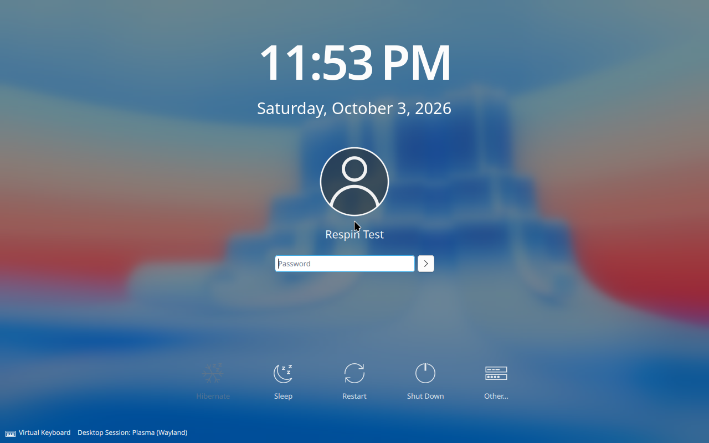

# RustScript migration verification

Branch: `codex/rustscript-scripts`, based on the original release commit
`3bdda3a`. The prior [verification record](docs/testing-3bdda3a.md), image,
checksums and test evidence are retained separately. They do not count as tests
of a newly built image.

## Implementation checks

- All seven original first-party Python/shell scripts have RustScript entry
  points and Rust implementations. The two inline Python Nix checks also moved
  to Rust, exposed by `tests/check_config.rs`.
- Cargo tests cover strict INI parsing, target-hostname validation, refusal of
  symlinks/existing disks, boot-entry parsing, shell/QEMU argument escaping,
  QMP/QGA response matching and EOF handling, and shutdown completion based on
  process exit status without a guest-agent success reply.
- A separate RustScript regression verifies that timed-out child processes are
  terminated and reaped, and that already-exited children clean up normally.
- Target-handoff tests preserve the GUI configuration and exact lock, check
  valid/default/invalid hostnames, reject host root and missing hardware, and
  execute the real patched Calamares argument-construction AST through PyO3.
- The guest integration fixture is Rust, including disk checks, partitioning,
  UI data, logging, progress callbacks and test-only configuration injection.
  It invokes the packaged upstream job, including our handoff patch, through
  CPython's API.
- Clippy is run with warnings denied; Rust formatting and Git whitespace checks
  are required before committing.

Host checks passed with Rust/Cargo 1.99.0 and `rust-script` 0.36.0: nine unit
tests both with and without the Calamares feature, the separate process-cleanup
regression, the handoff regression and actual upstream AST test. Negative CLI
checks rejected a device instead of an ISO, a wrong bootstrap checksum,
guest-only operations on the host, host-root target preparation and a recovery
run name containing a path.

Every entry point was also executed directly through its shebang with `--help`.
The shebangs include `rust-script --force` so shared Rust dependency changes are
checked by Cargo instead of reusing rust-script's otherwise stale script cache.

## Runtime validation

The corrected image was rebuilt on 2026-10-03 through `scripts/build_rootless.rs`.
All three named Nix checks and all nine packaged Rust unit tests passed. The
builder exited successfully and the host independently verified the checksum.

- File: `artifacts/rust-script/nixos-graphical-determinate-26.11.20261001.c59305b-x86_64-linux.iso`
- Size: 3,880,910,848 bytes
- SHA-256: `3dd85d328e420af4c88c016b45dc9c4f69460c82b7d628218371b17110676447`
- Nix store output: `/nix/store/d0fd1zgxnykdqvpx97rldf2bd1vdmkqi-nixos-graphical-determinate-26.11.20261001.c59305b-x86_64-linux.iso`

Both fresh tests passed the complete live USB boot, real Calamares installation,
orderly poweroff and installed-disk-only boot sequence under QEMU 11.1.1 with
KVM, 4 vCPUs, 8 GiB RAM and a new 40 GiB virtual disk per run:

- UEFI: `uefi-1791071352675-33155` — [result](docs/test-results/rust-uefi.json).
- BIOS: `bios-1791071644722-34133` — [result](docs/test-results/rust-bios.json).

The UEFI script was launched from `/tmp` to exercise repository discovery
outside the checkout. Both results record the corrected ISO's SHA-256. Initial
failures below are retained separately and are not counted as passes. All test
and builder VMs have stopped; no host block device was attached.

Both installed systems report Determinate Nix 3.23.0 (Nix 2.35.2), `fh`
0.1.27, an active Determinate Nixd socket and display manager, the target user
`respintest`, no live `nixos` account, no Calamares command in the system profile,
no installer template directory, and the original flake lock. Both installed
login screens were visually inspected; no interactive password-login test is
claimed.

### Initial build and regression discovery

The initial Rust-driven rootless build completed on 2026-10-03. Its three named
Nix checks and eight then-existing unit tests passed. The static Rust guest
bootstrap, persistent-store setup, image export and builder shutdown ran
without host root privileges. The image and log are retained under
`artifacts/rust-script-initial/`.

- File: `nixos-graphical-determinate-26.11.20261001.c59305b-x86_64-linux.iso`
- Size: 3,880,910,848 bytes
- SHA-256: `898b3200704b64c1a7b46d346bad4298caf08c637d06bfb2e9c39069efdfa00a`
- Nix store output: `/nix/store/dmrmj7h88kd4bmvv14p8dml19kcl3041-nixos-graphical-determinate-26.11.20261001.c59305b-x86_64-linux.iso`

The host's independent SHA-256 calculation matched the Rust builder's sidecar.
The original release image remains separate and unchanged. The flake lock is
also unchanged: SHA-256
`2a1e300d41e32889d2f108a9405294cf89f0a196d755bfc4bf43b8eea9852d69`.

Both initial runs booted the live Plasma/Calamares GUI. UEFI run
`uefi-1791070204260-27560` was interrupted during installation; the source of the
interrupt was not established. It is [recorded as failed](docs/test-results/rust-uefi-interrupted.json),
and its VM was stopped by the Rust process cleanup.

BIOS run `bios-1791070204232-27559` completed the real Calamares installation and
powered off, but the harness incorrectly awaited a shutdown RPC response. It is
also [recorded as failed](docs/test-results/rust-bios-shutdown-failure.json).
[QEMU's protocol](https://www.qemu.org/docs/master/interop/qemu-ga-ref.html#command-guest-shutdown)
sends no success reply to `guest-shutdown`; the corrected harness waits for
QEMU's zero exit status. The new ninth unit test covers both zero and nonzero
process exits with no reply. Ordinary RPC EOF still fails. Final tests use fresh
disks and a rebuilt image, not either of these partial runs.

## Scope

QEMU tests exercise BIOS/UEFI boot of the ISO as USB mass storage, the live
Plasma/Calamares GUI, real Calamares backend installation to a disposable disk,
and disk-only boot with runtime checks for Determinate Nix, `fh`, the daemon,
display manager, target user and unchanged lock. They do not automate all GUI
pages or password entry. Test-only guest-agent and serial-console settings are
not added by normal GUI installs.

Physical USB writes, real hardware, Secure Boot, encrypted/Btrfs/dual-boot
installations, alternative desktops and booting the newer-kernel entry are not
part of this migration's verification. No host reboot or sudo is required.
