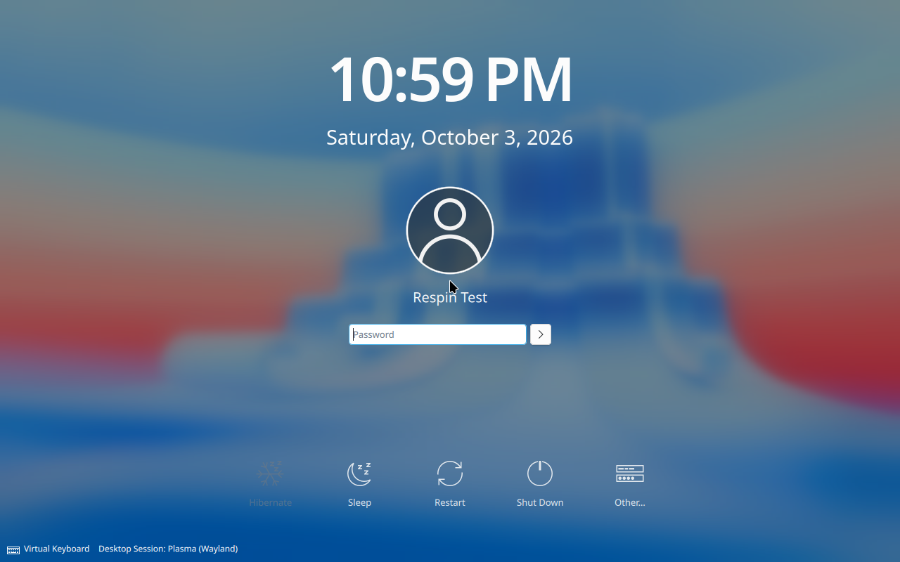

# Original implementation verification (commit 3bdda3a)

Historical evidence for the original Python/shell implementation. Commands in
this record refer to that commit, not the RustScript migration branch. See the
current [verification report](../TESTING.md) for the migrated implementation.

Date: 2026-10-03. Host: x86_64 Linux, QEMU 11.1.1 with KVM. No host reboot,
host Nix installation, elevated host permissions, or physical-drive writes were
needed. Builds and installations ran inside disposable virtual machines.

## Image identity

Filename: `nixos-graphical-determinate-26.11.20261001.c59305b-x86_64-linux.iso`

Size: 3,880,910,848 bytes (3.61 GiB).

SHA-256:

```text
df70e2d97e07cee6ba5b6e1c09d1b4ddd046fe799449b28782cb5fd04cfcd0e1
```

The builder and host independently calculated the same digest. The adjacent
`.iso.sha256` file can be checked with `sha256sum -c` from the artifact directory.
This checksum identifies this locally built respin; it is not a signature or
an official Determinate Systems release checksum.

Nix output:
`/nix/store/l2qwz0as1raakl4m26g5wikldb05syih-nixos-graphical-determinate-26.11.20261001.c59305b-x86_64-linux.iso`

The input lock is byte-identical to the upstream revision identified in the
README. Its SHA-256 is
`2a1e300d41e32889d2f108a9405294cf89f0a196d755bfc4bf43b8eea9852d69`.

## Checks

| Check | Result |
| --- | --- |
| Rootless build, export, and orderly builder shutdown | PASS |
| `nix flake check --no-update-lock-file -L` | PASS |
| Six Calamares handoff regression tests, against the patched package | PASS |
| Real `nixos-generate-config` execution and exact flake-template comparison | PASS |
| Strict INI parsing: flake enabled, LTS/latest kernel defaults correct | PASS |
| Python compilation, shell syntax, Git whitespace checks | PASS |
| BIOS: USB-media boot, Plasma/Calamares, install, disk-only boot | PASS |
| UEFI: USB-media boot, Plasma/Calamares, install, disk-only boot | PASS |

Firmware tests use the complete hybrid ISO as read-only USB mass storage behind
an emulated xHCI controller. No direct kernel boot is used for these tests. Each
installation uses a new 40 GiB virtual disk, 8 GiB RAM and four virtual CPUs.
UEFI uses OVMF without Secure Boot; BIOS uses QEMU's SeaBIOS.

The integration test runs the **actual packaged Calamares NixOS Python job**.
Only Calamares's UI-data, progress and logging interfaces are fixtures. Real
partition creation, hardware scanning, Nix evaluation/build/copy and bootloader
installation take place. The chosen target is Plasma, ext4, hostname
`respin-test`, user `respintest`, US keyboard and UTC, with unfree packages off.
The test then removes the installer media and boots the installed disk.

Assertions check Determinate Nix 3.23.0, `fh` 0.1.27, the Determinate daemon socket,
the display manager, target user and hostname, and the preserved input lock.
The installed target must not contain the live `nixos` user or Calamares.

The installation phases completed in `uefi-20261003-175025` and
`bios-20261003-175026`. An incorrect pre-boot harness check followed an absolute
target-store symlink from the live session and failed after installation. That
check is corrected. Disk-only verification resumes the same completed disks
with `scripts/boot_installed.py`; it does not substitute prebuilt disk images or
repeat the install. The resumed result records retain the original live-media
evidence and image hash, and identify the original run.

Final machine-readable records:

- [UEFI result](test-results/uefi.json), from
  `uefi-20261003-175025-boot-175916`.
- [BIOS result](test-results/bios.json), from
  `bios-20261003-175026-boot-175917`.

Both installed systems reached the SDDM login screen. Login/password handling
is not asserted by this backend test. Screenshots were visually inspected;
the UEFI screenshot is included below. Full logs and original run records remain
in the local, Git-ignored `artifacts/` directory. All test VMs have been stopped.



## Scope and limits

- The live Plasma desktop and Calamares welcome window are visually checked.
  Installation is a backend integration test, **not** a complete mouse-driven
  traversal of every Calamares page. In particular, its C++ partitioning and
  password-setting jobs are not exercised by the backend fixture.
- The test target has a QEMU guest agent and serial-console diagnostics added
  by the fixture. These options are absent from normal GUI installations.
- Firmware tests select the default LTS kernel (6.18.54). The newer-kernel entry
  (7.2.8) is built and its settings are checked, but its boot is not tested here.
- Alternative desktops, encrypted disks, Btrfs, dual boot, unusual hardware,
  Wi-Fi, real-machine firmware, and Secure Boot have not been validated.
- Internet access is required for installation. An offline installation is not
  promised by this respin.
- These tests establish bootability in the tested virtual firmware. They do
  not guarantee compatibility with every physical computer or verify a later
  write to a physical USB stick. The existing Samsung USB was not changed.
- A second clean-room reproducibility build has not been performed. Sources
  and inputs are pinned, but bit-for-bit reproducibility is not claimed.

## Issues caught during development

1. Stock Calamares did not select the generated flake for `nixos-install`.
   The small handoff patch makes the target configuration explicit.
2. Merging live defaults for the newer kernel could duplicate the INI section.
   The specialization now replaces the section and both variants are tested.
3. The generator embeds its template in an interpolating Perl heredoc. Literal
   Nix `${...}` interpolation must be escaped for that embedding. A test now
   executes the real generator and compares the resulting file.

Earlier failed or interrupted development runs remain in the ignored local
`artifacts/` directory. They are not release-test passes. Only the final runs
identified by this image digest count toward the results above.
